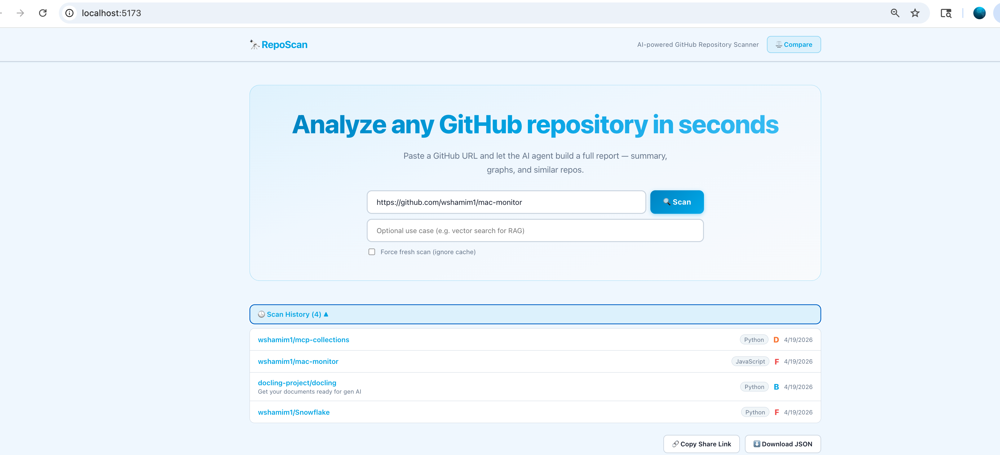
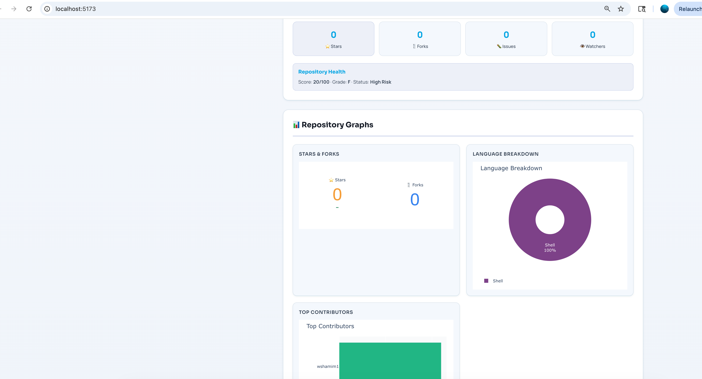
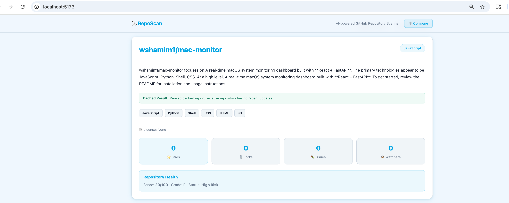

# reposcan — GitHub Repository Scanner

A full-stack AI-powered GitHub repository scanner built with:

- **LangChain ReAct Agent** — orchestrates GitHub API tools to build deep repo analysis
- **FastAPI backend** — async REST API with background job processing
- **React + Vite frontend** — interactive dashboard with Plotly graphs
- **GitHub API (PyGithub)** — repo metadata, commits, contributors, languages
- **Plotly** — language pie, commit activity, contributor bars, similar-repo scatter

## Features

- **AI-Powered Summary** — LangChain ReAct agent calls 7 GitHub tools and synthesizes a JSON report
- **Code Structure Analysis** — Directory tree, language breakdown, file counts
- **5 Interactive Graphs** — Language pie, commit activity bar, contributor bar, stars/forks gauge, similar-repos scatter
- **Similar Repo Discovery** — Topic and language-based GitHub search
- **Async scan jobs** — FastAPI background tasks with polling (no timeouts on long scans)
- **React Dashboard** — Clean UI with live status, summary card, graphs panel, and repo cards
- **Rich CLI** — Full terminal interface without the web UI

## Screenshots

### Home + Scan History



### Repository Summary + Graphs



Current placeholder image:



## Quick Start

```bash
# 1. Clone / open the project
cd ~/Desktop/Codes/reposcan

# 2. Create a virtual environment
python3 -m venv .venv && source .venv/bin/activate

# 3. Install dependencies
pip install -r requirements.txt

# 4. Configure secrets
cp .env.example .env
# Edit .env and add your OPENAI_API_KEY and GITHUB_TOKEN

# 5. Run the scanner
python main.py serve          # start FastAPI on :8000
```

Then in a second terminal:

```bash
cd frontend
cp .env.example .env          # (optional, proxy already configured)
npm run dev                   # start React on :5173
```

Open **http://localhost:5173** and paste any GitHub URL.

## Start/Stop Scripts

```bash
# Start backend + frontend in background
./start.sh

# Stop both services
./stop.sh
```

Logs are written to:

- `.run/backend.log`
- `.run/frontend.log`

## CLI Usage (no web UI needed)

```bash
# Scan a repo (full analysis)
python main.py scan https://github.com/langchain-ai/langchain

# Scan with verbose agent reasoning shown
python main.py scan https://github.com/langchain-ai/langchain --verbose

# Only generate graphs (no LLM needed)
python main.py graphs https://github.com/langchain-ai/langchain

# Find similar repos only
python main.py similar https://github.com/langchain-ai/langchain
```

## Project Structure

```
reposcan/
├── main.py                  # CLI entry point (Click) — also `serve` command
├── requirements.txt
├── .env.example
├── backend/
│   ├── main.py              # FastAPI app (CORS, /api/scan, /api/graphs, /api/similar)
│   └── src/
│       ├── agents/
│       │   └── scanner_agent.py # LangChain ReAct agent
│       ├── tools/
│       │   ├── github_tools.py  # GitHub API tools (repo info, commits, structure…)
│       │   └── similarity_tools.py # Similar repo search tool
│       ├── graphs/
│       │   └── repo_visualizer.py  # Plotly graph generation
│       └── utils/
│           └── helpers.py       # URL parsing, formatting helpers
├── frontend/                # React + Vite
│   ├── src/
│   │   ├── App.jsx
│   │   ├── pages/HomePage.jsx
│   │   ├── components/
│   │   │   ├── SearchBar.jsx
│   │   │   ├── SummaryCard.jsx
│   │   │   ├── GraphsPanel.jsx   # react-plotly.js
│   │   │   └── SimilarRepos.jsx
│   │   ├── hooks/useScan.js      # async polling hook
│   │   └── utils/api.js          # axios API calls
│   └── vite.config.js            # proxy /api → :8000
└── output/                  # CLI graph output (JSON)
```

## Environment Variables

| Variable | Required | Description |
|---|---|---|
| `OPENAI_API_KEY` | Yes | Your OpenAI API key |
| `GITHUB_TOKEN` | No | GitHub PAT for higher rate limits (60 → 5000 req/hr) & private repos; public repos work without it |
| `LLM_MODEL` | No | Model name (default: `gpt-4o-mini`) |
| `OUTPUT_DIR` | No | CLI graph output folder (default: `./output`) |
| `FRONTEND_URL` | No | Production frontend URL for CORS (FastAPI) |

## License

This project is open source and available under the MIT License.

See [LICENSE](LICENSE) for full terms.
